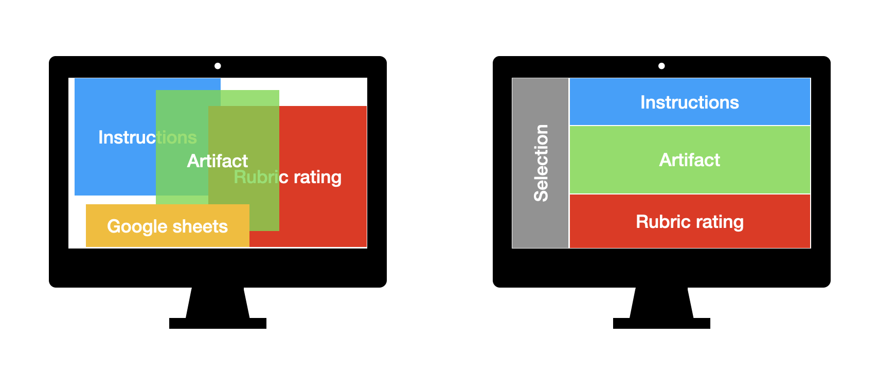
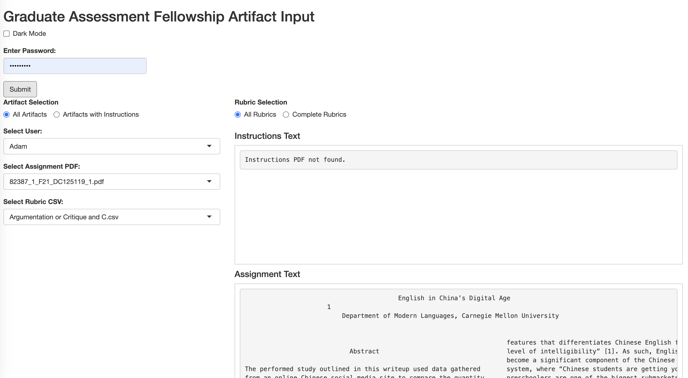
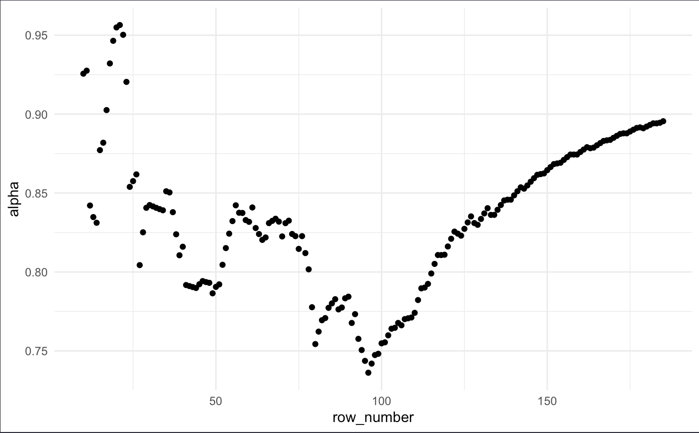

# 🧠 Building Better Assessment: Scalable Tools for Human and AI Scoring

## 📚 *Reference:*
**Bramlett, A. A.** (2025). *From Bottlenecks to Breakthroughs: Building Secure, Scalable, and Data-Driven Assessment Systems.* Graduate Assessment Fellowship Report, Dietrich College, CMU.

---

## 📌 Overview

This project provides a scalable, transparent infrastructure for educational assessment, developed during the Graduate Assessment Fellowship at Carnegie Mellon University. It features a secure scoring app, a robust reliability framework, and an AI-assisted workflow for evaluating student artifacts. All tools are designed to support both human and AI raters, with attention to reproducibility, FERPA compliance, and modular design.

---

## 📂 Repository Contents

### 🧩 `survey revised/app.R`

**Dynamic Scoring App (R + Shiny)**  
A secure, user-friendly interface for scoring student work with embedded prompts, rubrics, and real-time validation. Built to streamline rater workflow and ensure scoring accuracy.

---

**Before (left) and after (right): manual vs. app-based rating workflow**

---

**Example of the interactive scoring interface**

---

### 📈 `reliability.Rmd`

**Reliability Analysis Script (R Markdown)**  
Calculates inter-rater agreement using exact match, one-off agreement, and Cohen’s Kappa. Built to compare human-human and AI-human ratings, with visualization support.

---

**Human–Human reliability over time**

---

### 🧠 `survey revised/work_flow_updated.Rmd`

**AI-Assisted Artifact Scoring Pipeline**  
An LLM-powered system using GPT-4.0 mini (via CMU’s secure LiteLLM deployment) for rubric-aligned artifact evaluation. Includes prompt generation, response tracking, and audit-ready output.

---

**LLM–LLM and LLM–Human scoring comparison**

---

## 🌟 Key Features

- 🔐 **FERPA-Compliant Infrastructure**  
  All scoring processes are secure and internal to CMU systems.

- ⚖️ **Human & AI Calibration**  
  Multi-level reliability checks and detailed rubric diagnostics.

- 🤖 **LLM Integration**  
  GPT-4.0 mini deployed as a secure, scalable rater within the assessment system.

- 📊 **Tidy, Structured Output**  
  Data formatted for immediate aggregation, analysis, and visualization in R.

---

## 🛠️ Getting Started

1. Clone this repository.
2. Launch the Shiny app via `app.R` for human scoring.
3. Run `reliability.Rmd` to evaluate consistency across raters or compare AI to human scores.
4. Use `work_flow_updated.Rmd` to score artifacts using GPT-4.0 mini via CMU’s LiteLLM proxy.

---

## 📣 Citation

Please cite the original report if this toolkit assists your research or program development:

> Bramlett, A. A. (2025). *From Bottlenecks to Breakthroughs: Building Secure, Scalable, and Data-Driven Assessment Systems.* Graduate Assessment Fellowship Report, Dietrich College, CMU.
